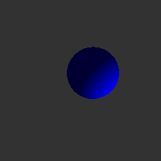

# 球体のレイトレーシング

3DCG描画用のライブラリを使用せず、Pythonで3DCGを描画するプログラムを作成。
「3次元空間にある物体は、どのような計算によって2次元のスクリーンへ映し出されるのか」を知りたいと思ったことが、このプログラムを作ったきっかけ。
3次元空間に配置した1つの球体をレイトレーシングによって描画。
計算には、例えば次のような考え方を使用している。

- ベクトルの外積を用いたカメラの向きの計算。
- 視線を表す直線と球面の方程式を連立した物体との交差判定（実数解ありなら描画、実数解なしなら描画しない）。
- 面の法線ベクトルと光のベクトルの内積を用いた、球面の明るさの計算。

それぞれの計算方法については、今後別の記事で詳しく解説する予定である。
今後はカメラを動かしてみたり、複数の物体を描画してみたり、レイトレーシングではないもっと高速なレンダリングを勉強してみたり、3Dゲーム作ってみたりしたい。

## 生成画像

## 必要環境

- Python
- Pillow

## 実行方法

このリポジトリのフォルダーで、次のコマンドを実行。

    python main.py

実行すると、描画結果がPNG画像として保存される。

